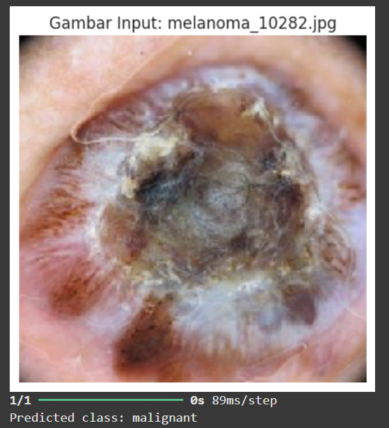
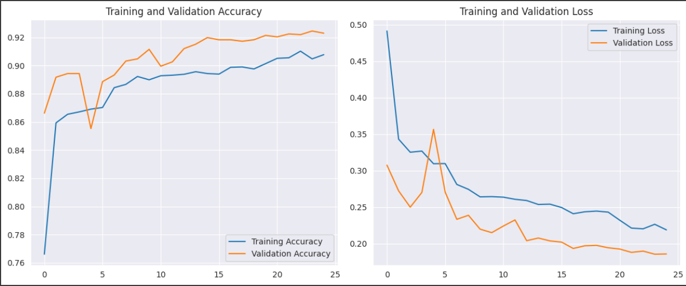

# Project Klasifikasi Gambar Melanoma

Project ini adalah implementasi model klasifikasi citra untuk mendeteksi kanker kulit melanoma menggunakan **TensorFlow** dan pustaka pendukung lainnya. Proyek ini mencakup preprocessing data, pelatihan model CNN, evaluasi performa, serta konversi model ke format **TensorFlow Lite (TFLite)** dan **TensorFlow.js** untuk deployment.

## 🚀 Teknologi dan Library yang Digunakan
- **TensorFlow** — untuk membangun dan melatih model CNN klasifikasi.
- **Matplotlib** — untuk visualisasi data dan hasil pelatihan.
- **Numpy** — untuk pengolahan data numerik.
- **Pandas** — untuk eksplorasi data.
- **Seaborn** — untuk membuat visualisasi statistik seperti confusion matrix.
- **Scikit-learn** — untuk evaluasi model (classification report, confusion matrix, dll).
- **TFLite** — untuk mengkonversi model ke format ringan untuk perangkat mobile.
- **TensorFlow.js** — untuk keperluan deployment ke web (jika digunakan).

## 📂 Struktur Proyek
```plaintext
.
├── dataset/
│   ├── benign/
│   └── melanoma/
├── saved_model/
│   ├── assets/
│   ├── variables/
│   └── saved_model.pb
├── tflite/
│   ├── label.txt
│   └── model.tflite
├── tfjs_model/
│   ├── model.json
│   └── group1-shard*.bin
├── Klasifikasi_Gambar_Melanomena_Cancer.ipynb
├── README.md
└── requirements.txt
```

## Langkah-langkah Penggunaan

### 1. Persiapkan Dataset
- Dataset terdiri dari dua kelas: benign dan melanoma.
- Gambar-gambar dikonversi ke ukuran 224x224 piksel.
- Data dibagi menjadi data latih, validasi, dan uji menggunakan pembagian manual atau fungsi pembagi dataset.

### 2. Training Model
- Model CNN dibangun menggunakan arsitektur dasar dengan beberapa layer Conv2D, MaxPooling, dan Dense.
- Fungsi aktivasi yang digunakan adalah ReLU dan Softmax.
- Training dilakukan selama beberapa epoch dengan visualisasi accuracy dan loss.

### 3. Evaluasi Model
- Evaluasi dilakukan pada data uji menggunakan metrik:
  - Accuracy
  - Classification Report (Precision, Recall, F1-score)
  - Recall
  - Confusion Matrix

### 4. Konversi Model
- Model disimpan dalam format ****SavedModel**.
- Konversi ke TFLite menggunakan **TFLiteConverter**.
- Konversi ke TensorFlow.js menggunakan tensorflowjs_converter.

### 5. Inference


## Instalasi
Clone project ini lalu install semua dependencies:

```bash
git clone https://github.com/username/Klasifikasi_Gambar_Melanoma.git
cd Klasifikasi_Gambar_Melanoma
pip install -r requirements.txt
```

Atau install satu per satu:

```bash
pip install tensorflow matplotlib numpy pandas seaborn scikit-learn
```

## 🖼️ Visualisasi



